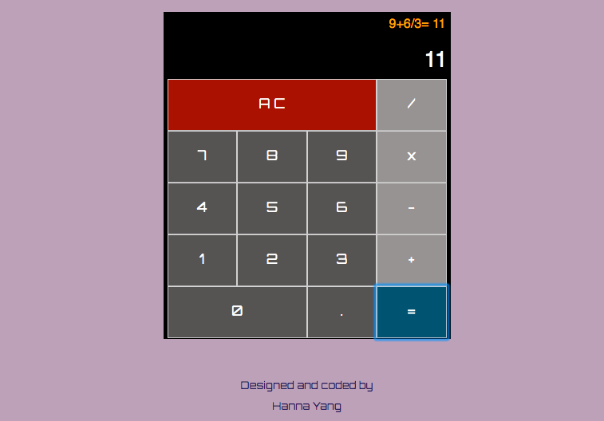

# React Calculator
This project is to fulfill freeCodeCamp Front End Libraries certification Project 4: https://learn.freecodecamp.org/front-end-libraries/front-end-libraries-projects/build-a-javascript-calculator

[](screenshot)

## Library used

- React

## How to run: 
```
npm install 
npm start
```